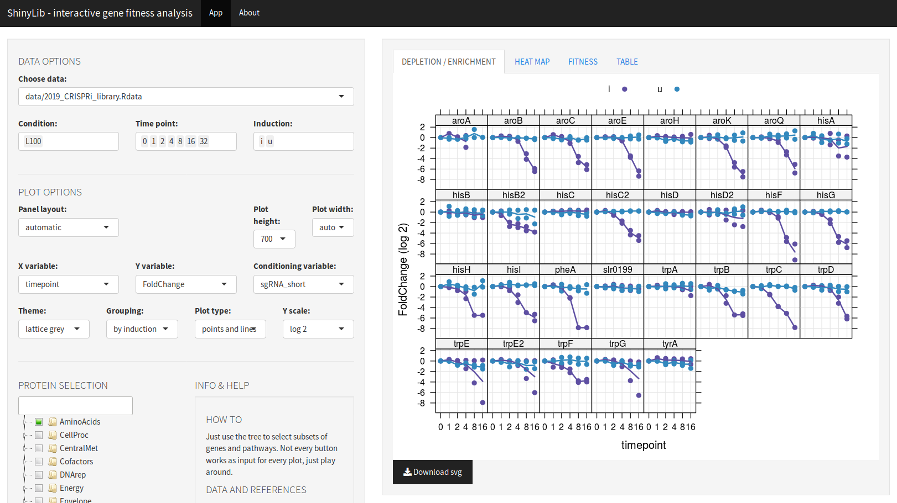

# ShinyLib

R Shiny based interface for browsing fitness data from transposon or CRISPRi libraries
**Available on [Shinyapps.io](https://m-jahn.shinyapps.io/ShinyLib/)!**

### Related publications

- Yao et al., *Pooled CRISPRi screening of the cyanobacterium Synechocystis sp PCC 6803 for enhanced industrial phenotypes*. Nature Communications, **2020**. [Link](https://www.nature.com/articles/s41467-020-15491-7)
- Jahn et al., *Protein allocation and utilization in the versatile chemolithoautotroph Cupriavidus necator*. BioRxiv.org. **2021**. Submitted manuscript. [Link]()

### Getting started

Simply run the app at https://m-jahn.shinyapps.io/ShinyLib/!

If you want to *run ShinyLib locally*, you need to have R (optionally also Rstudio) and some of its libraries installed:

- `shiny`
- `shinythemes`
- `shinyTree`
- `lattice`
- `latticeExtra`
- `latticetools` (from https://github.com/m-jahn/lattice-tools)
- `directlabels`
- `tidyr`
- `dplyr`
- `dendextend`
- `configr`

Open `global.R`, `server.R` or `ui.R` in RStudio and push the `Run App` button in Rstudio, done!
You can also run the app from R console, just call `runApp("path-to-ShinyLib)`.

### R Shiny based browser for transposon or CRISPRi mutant libraries

ShinyLib is an app for exploration of gene-centered data from enrichment or depletion studies. Such a library with thousands of mutants can be grown in competition experiments, leading to the depletion of growth-inhibited mutants and enrichment of faster growing mutants. By extracting the DNA and sequencing the barcode/sgRNA of the mutant population, we can investigate which genes are _essential_ or contribute to _fitness_ for the selected conditions.

Features:

- Displays dot plots of fold depletion/enrichment over time
- Heatmaps and clustering of proteins/genes by fitness similarity
- Fitness scores can be plotted as variable of one or two conditions
- The original data table can be filtered by pathways or single genes, and selected data can be downloaded
- Different variables can be plotted on X and Y axis, or used as conditioning variable (panel-view)
- All charts are interactive R Shiny modules and can be adjusted by many parameters

### Structure

ShinyLib consists of a set of R scripts that determine the functionality.

- `global.R` loads the `*.Rdata` data sets and the accompanying `*.yml` configuration files.
- `server.R` contains the main body of functions. The server obtains input parameters from the GUI and adjusts the graphical output accordingly (changes charts on the fly)
- `ui.R` The GUI contains the interactive modules such as sliders and check boxes.
- `dotplot.R`, `heatmap.R`,`fitness.R` Plotting functions for each tab
- `custom_themes.R` contains a set of customized lattice themes
- `custom_panel_functions.R` contains a set of custom lattice panel functions
- `helpbox.R` contains info boxes for help, contact, and background information

### Input data

- ShinyLib uses fold change and fitness data derived from next generation sequencing
- Can be easily customized for use with other library-type data
- Can be deployed on a shiny server for web-access
